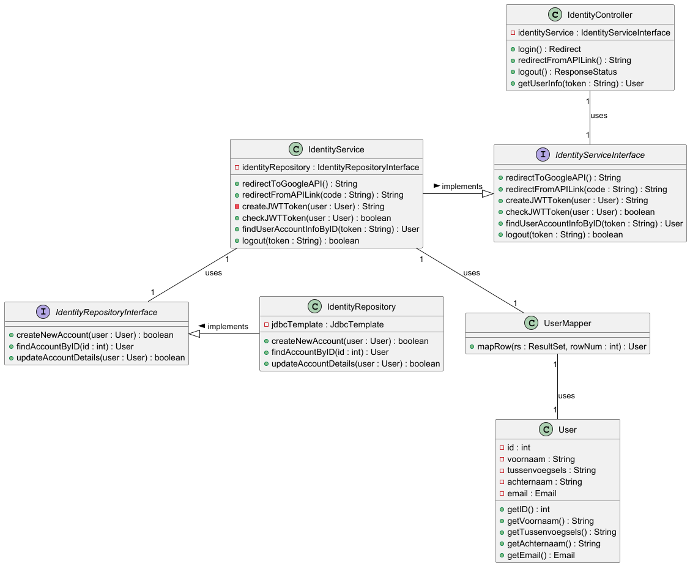

# Ontwerpvraag:

Hoe zorg je dat een wijziging in een of meerdere APIs niet leidt tot een grote wijziging in de applicatie? Specifieker:
hoe zorg je ervoor dat een wijziging in de API van een externe service niet leidt tot een wijziging in de front-end maar
flexibel kan worden opgevangen door de back-end?

## API: Identity provider

# Componenten:

- Controller
- Service
- Repository
- Domein klasse
- User Mapper

# Lijst 1: Component + Naam + Verantwoordelijkheid

| Component       | Naam                | Verantwoordelijkheid                                                                                                              |
|-----------------|---------------------|-----------------------------------------------------------------------------------------------------------------------------------|
| Controller      | IndentityController | Het opvangen van (HTTP) requests om in mogen loggen                                                                               | 
| Service         | IdentityService     | Heeft als verantwoordelijkheid dat deze alle logica bevat om een gebruiker zijn inlogpoging goed op te slaan in de DB             |
| Repository      | IdentityRepository  | Heeft als verantwoordelijkheid om een connectie te hebben met de database om vanuit daar gegevens op te halen én in te schrijven. |
| User Domein     | User                | Deze bevat alle attributen / variabelen die in de database verwerkt staan.                                                        | 
| Database mapper | UserMapper          | Heeft als verantwoordelijkheid een juiste database structuur terug te geven.                                                      | 

# Lijst 2: Interfaces + Methoden + Parameters + return waarde 1e versie

| Interface                   | Methoden             | Parameters                | Return waarde       |
|-----------------------------|----------------------|---------------------------|---------------------|
| IdentityServiceInterface    | redirectToGoogleAPI  | -                         | String redirectlink |
| IdentityServiceInterface    | redirectFromAPILink  | @RequestParam String code | String token        | 
| IdentityServiceInterface    | createJWTToken       | int userID                | String JWTToken     | 
| IdentityServiceInterface    | checkJWTToken        | String JWTToken           | boolean isValid     |
| IdentityServiceInterface    | getUserIDFromToken   | String JWTToken           | int userID          |
| IdentityRepositoryInterface | createNewAccount     | User user                 | boolean isCreated   |
| IdentityRepositoryInterface | findAccountByID      | int userID                | User user           |
| IdentityRepositoryInterface | updateAccountDetails | User user                 | boolean isUpdated   |

# Dynamic diagram

# Class diagram

