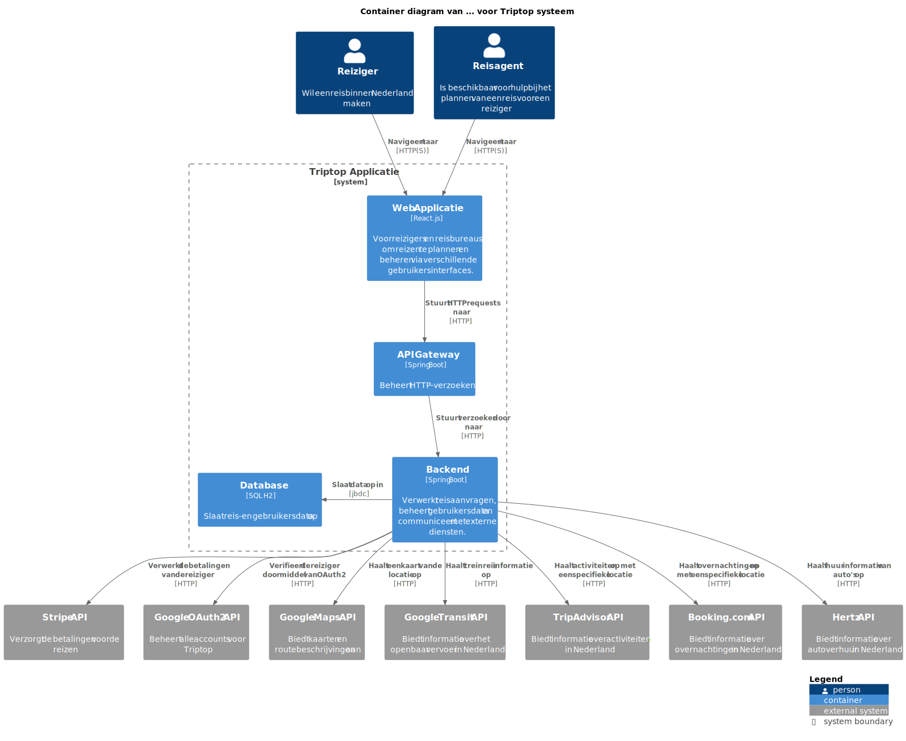

# Software Guidebook Triptop

## 1. Introduction

Dit software guidebook geeft een overzicht van de Triptop-applicatie. Het bevat een samenvatting van het volgende:

1. De vereisten, beperkingen en principes.
1. De software-architectuur, met inbegrip van de technologiekeuzes op hoog niveau en de structuur van de software.
1. De ontwerp- en codebeslissingen die zijn genomen om de software te realiseren.
1. De architectuur van de infrastructuur en hoe de software kan worden geinstalleerd.

## 2. Context

### Achtergrond

#### Waarom wordt deze software ontwikkeld?

TripTop zou graag deze software ontwikkeld willen zien om een exclusief standpunt in de Nederlandse markt te kunnen
innemen.
Triptop wil een reisplatform ontwikkelen waarbij de reiziger zelf een reis kan samenstellen. Triptop wil meegaan in de
trend van reizigers die zelf hun reis samenstellen én wil een unieke mogelijkheid bieden door, het
traditionele idee van het boeken bij een reisbureau te vervangen door een online platform waarbij een reiziger zelf een
reis kan samenstellen. Reizigers hebben hierdoor zelf meer controle over hoe ze hun reis indelen én plannen.

Triptop zou graag een software ontwikkeling willen ontvangen om in te kunnen spelen op de trend dat reizigers hun reis
bepalen én boeken. Reizigers kunnen zodra deze applicatie is ontwikkeld, zelf hun reis samenstellen, boeken, aanpassen,
annuleren én betalen. Hierdoor is geen tussenkomst van een reisbureau nodig. Wel wil Triptop de mogelijkheid aanbieden
voor tweedelijns ondersteuning voor reizigers die vastlopen op het plannen van hun reis.

Triptop is helaas niet de eerste die met dit idee is gekomen. Op de globale markt zijn er al een aantal partijen die een
reiziger deze mogelijkheden biedt, neem als voorbeeld [Ellipsis Travel](https://www.ellipsistravel.com/).

#### Wie zijn de doelgroep?

Triptop richt zich specifiek op de Nederlandse markt, in tegenstelling met Ellipsis. Triptop wil zich onderscheiden door
een unieke mogelijkheid te bieden voor reizigers om zelf hun reis samen te stellen. Hierdoor heeft Triptop als doelgroep
een brede groep reizigers die zelf hun reis / trip willen samenstellen.

### Context diagram

|  |
|----------------------------------------------------------- 
| Het context diagram                                       |

Zoals er in het context diagram te zien is, is de Triptop-applicatie het centrale punt van de software. De applicatie
heeft meerdere externe systemen waarmee het communiceert, deze sytemen zijn van belang voor het correct functioneren van
de Triptop-applicatie. De externe systemen waarvan de Triptop-applicatie afhankelijk zijn, zijn zichtbaar in het context
diagram. Hier wordt ook per extern systeem een korte uitleg gegeven wat deze inhoudt én enkele voorbeelden van externe
systemen.

> [!IMPORTANT]
> Werk zelf dit hoofdstuk uit met context diagrammen en een beschrijving van de context van de software.

#### Toelichting op de functionaliteit

#### Toelichting op de gebruikers

#### Externe systemen

In dit deelhoofdstuk wordt er een korte toelichting gegeven op de externe systemen die van belang zijn voor de
Triptop-applicatie. Hierbij worden enkele voorbeelden gegeven maar ook wat de verwachte functionaliteit van de externe
systemen zijn.

Toelichting op de context van de software inclusief System Context Diagram:

* Functionaliteit
* Gebruikers
* Externe systemen

## 3. Functional Overview

Om de belangrijkste features toe te lichten zijn er user stories en twee domain stories gemaakt en een overzicht van het
domein in de vorm van een domeinmodel. Op deze plek staat typisch een user story map maar die ontbreekt in dit
voorbeeld.

### 3.1 User Stories

#### 3.1.1 User Story 1: Reis plannen

Als gebruiker wil ik een zelfstandig op basis van diverse variabelen (bouwstenen) een reis kunnen plannen op basis van
mijn reisvoorkeuren (wel/niet duurzaam reizen, budget/prijsklasse, 's nachts reizen of overdag etc.) zodat ik op
vakantie kan gaan zonder dat hiervoor een reisbureau benodigd is.

#### 3.1.2 User Story 2: Reis boeken

Als gebruiker wil ik een geplande reis als geheel of per variabele (bouwsteen) boeken en betalen zodat ik op vakantie
kan gaan zonder dat hiervoor een reisbureau benodigd is.

#### 3.1.3 User Story 3: Reis cancelen

Als gebruiker wil ik een geboekte reis, of delen daarvan, kunnen annuleren zodat ik mijn geld terug kan krijgen zonder
inmenging van een intermediair zoals een reisbureau.

#### 3.1.4 User Story 4: Reisstatus bewaren

Als gebruiker wil ik mijn reisstatus kunnen bewaren zonder dat ik een extra account hoef aan te maken zodat ik mijn reis
kan volgen zonder dat ik daarvoor extra handelingen moet verrichten.

#### 3.1.5 User Story 5: Bouwstenen flexibel uitbreiden

Als gebruiker wil ik de bouwstenen van mijn reis flexibel kunnen uitbreiden met een zelf te managen stap (bijv. met
providers die niet standaard worden aangeboden zoals een andere reisorganisatie, hotelketen etc.) zodat ik mijn reis
helemaal kan aanpassen aan mijn wensen.

### 3.2 Domain Story Reis Boeken (AS IS)

### 3.3 Domain Story Reis Boeken (TO BE)

### 3.4 Domain Model

## 4. Quality Attributes

Voordat deze casusomschrijving tot stand kwam, heeft de opdrachtgever de volgende ISO 25010 kwaliteitsattributen benoemd
als belangrijk:

* Compatibility -> Interoperability (Degree to which a system, product or component can exchange information with other
  products and mutually use the information that has been exchanged)
* Reliability -> Fault Tolerance (Degree to which a system or component operates as intended despite the presence of
  hardware or software faults)
* Maintainability -> Modularity (Degree to which a system or computer program is composed of discrete components such
  that a change to one component has minimal impact on other components)
* Maintainability -> Modifiability (Degree to which a product or system can be effectively and efficiently modified
  without introducing defects or degrading existing product quality)
* Security -> Integrity (Degree to which a system, product or component ensures that the state of its system and data
  are protected from unauthorized modification or deletion either by malicious action or computer error)
* Security -> Confidentiality (Degree to which a system, product or component ensures that data are accessible only to
  those authorized to have access)

## 5. Constraints

> [!IMPORTANT]
> Beschrijf zelf de beperkingen die op voorhand bekend zijn die invloed hebben op keuzes die wel of niet gemaakt kunnen
> of mogen worden.

### Het project
Hier worden algemene constraints benoemd binnen het project. 

#### Proof of concept
Het project loopt van 31-03-2025 tot 04-04-2025, waarbij de laatste week gericht is op het bouwen van functionaliteit. Deze korte tijdsduur beperkt de hoeveelheid functionaliteit die uitgewerkt kan worden. Het eindresultaat is een proof of concept, zodat mogelijke uitdagingen en sterke punten gevonden kunnen worden.

De front-end valt buiten de scope van dit project. De focus ligt op de back-end, waarbij de prototypes specifiek hierop gericht zullen zijn.

#### Integratie tussen prototypes
Door de korte tijdsduur is volledige integratie mogelijk niet haalbaar.

#### Teamgrootte
Het team bestaat uit 4 leden, bestaande uit studenten:
- Julius Morselt
- Thieme Wijgman
- Bryan Velthuizen
- Daniel Sung

Dit beperkt de mogelijke functionaliteit die gebouwd kan worden

### De applicatie
Hier worden de constraints binnen de applicatie benoemd.

#### Database
De gekozen database is een H2-database, een in-memory database. Het nadeel hiervan is dat de gegevens verloren gaan wanneer de applicatie stopt, tenzij we ze expliciet in een bestand opslaan. Dit kan de persistentie beperken in een applicatie die voor het publiek beschikbaar moet zijn.

#### Afhankelijkheid van externe systemen
De applicatie "TripTop" maakt gebruik van externe API's om informatie over reizen, vervoersmogelijkheden en kaarten op te halen. Bij een storing in deze systemen zijn deze functionaliteiten niet meer beschikbaar.

#### Transportmiddelen
De vervoermogelijkheden binnen de applicatie richten zich voornamelijk op auto's, treinen en bussen. Vliegtuigen, boten en andere transportmiddelen zijn niet relevant voor deze applicatie.

#### Locatie
De applicatie is ontwikkeld om exclusief in Nederland te werken en is niet toegankelijk buiten Nederland.

## 6. Principles
> [!IMPORTANT]
> Beschrijf zelf de belangrijkste architecturele en design principes die zijn toegepast in de software.

## 7. Software Architecture

### 7.1. Containers

#### 7.1.1 Dynamic Diagram 1: Inloggen

> [!IMPORTANT]
> Voeg toe: Container Diagram plus een Dynamic Diagram van een aantal scenario's inclusief begeleidende tekst.

### 7.2. Components

> [!IMPORTANT]
> Voeg toe: Component Diagram plus een Dynamic Diagram van een aantal scenario's inclusief begeleidende tekst.

### 7.3. Design & Code

> [!IMPORTANT]
> Voeg toe: Per ontwerpvraag een Class Diagram plus een Sequence Diagram van een aantal scenario's inclusief
> begeleidende tekst.

## 8. Architectural Decision Records

> [!IMPORTANT]
> Voeg toe: 3 tot 5 ADR's die beslissingen beschrijven die zijn genomen tijdens het ontwerpen en bouwen van de software.

### 8.1. ADR-001 TITLE

> [!TIP]
> These documents have names that are short noun phrases. For example, "ADR 1: Deployment on Ruby on Rails 3.0.10" or "
> ADR 9: LDAP for Multitenant Integration". The whole ADR should be one or two pages long. We will write each ADR as if
> it
> is a conversation with a future developer. This requires good writing style, with full sentences organized into
> paragraphs. Bullets are acceptable only for visual style, not as an excuse for writing sentence fragments. (Bullets
> kill
> people, even PowerPoint bullets.)

#### Context

> [!TIP]
> This section describes the forces at play, including technological, political, social, and project local. These forces
> are probably in tension, and should be called out as such. The language in this section is value-neutral. It is simply
> describing facts about the problem we're facing and points out factors to take into account or to weigh when making
> the
> final decision.

#### Considered Options

> [!TIP]
> This section describes the options that were considered, and gives some indication as to why the chosen option was
> selected.

#### Decision

> [!TIP]
> This section describes our response to the forces/problem. It is stated in full sentences, with active voice. "We
> will …"

#### Status

> [!TIP]
> A decision may be "proposed" if the project stakeholders haven't agreed with it yet, or "accepted" once it is agreed.
> If a later ADR changes or reverses a decision, it may be marked as "deprecated" or "superseded" with a reference to
> its
> replacement.

#### Consequences

> [!TIP]
> This section describes the resulting context, after applying the decision. All consequences should be listed here, not
> just the "positive" ones. A particular decision may have positive, negative, and neutral consequences, but all of them
> affect the team and project in the future.

### 8.2. ADR-002 TITLE

> [!TIP]
> These documents have names that are short noun phrases. For example, "ADR 1: Deployment on Ruby on Rails 3.0.10" or "
> ADR 9: LDAP for Multitenant Integration". The whole ADR should be one or two pages long. We will write each ADR as if
> it
> is a conversation with a future developer. This requires good writing style, with full sentences organized into
> paragraphs. Bullets are acceptable only for visual style, not as an excuse for writing sentence fragments. (Bullets
> kill
> people, even PowerPoint bullets.)

#### Context

> [!TIP]
> This section describes the forces at play, including technological, political, social, and project local. These forces
> are probably in tension, and should be called out as such. The language in this section is value-neutral. It is simply
> describing facts about the problem we're facing and points out factors to take into account or to weigh when making
> the
> final decision.

#### Considered Options

> [!TIP]
> This section describes the options that were considered, and gives some indication as to why the chosen option was
> selected.

#### Decision

> [!TIP]
> This section describes our response to the forces/problem. It is stated in full sentences, with active voice. "We
> will …"

#### Status

> [!TIP]
> A decision may be "proposed" if the project stakeholders haven't agreed with it yet, or "accepted" once it is agreed.
> If a later ADR changes or reverses a decision, it may be marked as "deprecated" or "superseded" with a reference to
> its
> replacement.

#### Consequences

> [!TIP]
> This section describes the resulting context, after applying the decision. All consequences should be listed here, not
> just the "positive" ones. A particular decision may have positive, negative, and neutral consequences, but all of them
> affect the team and project in the future.

### 8.3. ADR-003 TITLE

> [!TIP]
> These documents have names that are short noun phrases. For example, "ADR 1: Deployment on Ruby on Rails 3.0.10" or "
> ADR 9: LDAP for Multitenant Integration". The whole ADR should be one or two pages long. We will write each ADR as if
> it
> is a conversation with a future developer. This requires good writing style, with full sentences organized into
> paragraphs. Bullets are acceptable only for visual style, not as an excuse for writing sentence fragments. (Bullets
> kill
> people, even PowerPoint bullets.)

#### Context

> [!TIP]
> This section describes the forces at play, including technological, political, social, and project local. These forces
> are probably in tension, and should be called out as such. The language in this section is value-neutral. It is simply
> describing facts about the problem we're facing and points out factors to take into account or to weigh when making
> the
> final decision.

#### Considered Options

> [!TIP]
> This section describes the options that were considered, and gives some indication as to why the chosen option was
> selected.

#### Decision

> [!TIP]
> This section describes our response to the forces/problem. It is stated in full sentences, with active voice. "We
> will …"

#### Status

> [!TIP]
> A decision may be "proposed" if the project stakeholders haven't agreed with it yet, or "accepted" once it is agreed.
> If a later ADR changes or reverses a decision, it may be marked as "deprecated" or "superseded" with a reference to
> its
> replacement.

#### Consequences

> [!TIP]
> This section describes the resulting context, after applying the decision. All consequences should be listed here, not
> just the "positive" ones. A particular decision may have positive, negative, and neutral consequences, but all of them
> affect the team and project in the future.

### 8.4. ADR-004 TITLE

> [!TIP]
> These documents have names that are short noun phrases. For example, "ADR 1: Deployment on Ruby on Rails 3.0.10" or "
> ADR 9: LDAP for Multitenant Integration". The whole ADR should be one or two pages long. We will write each ADR as if
> it
> is a conversation with a future developer. This requires good writing style, with full sentences organized into
> paragraphs. Bullets are acceptable only for visual style, not as an excuse for writing sentence fragments. (Bullets
> kill
> people, even PowerPoint bullets.)

#### Context

> [!TIP]
> This section describes the forces at play, including technological, political, social, and project local. These forces
> are probably in tension, and should be called out as such. The language in this section is value-neutral. It is simply
> describing facts about the problem we're facing and points out factors to take into account or to weigh when making
> the
> final decision.

#### Considered Options

> [!TIP]
> This section describes the options that were considered, and gives some indication as to why the chosen option was
> selected.

#### Decision

> [!TIP]
> This section describes our response to the forces/problem. It is stated in full sentences, with active voice. "We
> will …"

#### Status

> [!TIP]
> A decision may be "proposed" if the project stakeholders haven't agreed with it yet, or "accepted" once it is agreed.
> If a later ADR changes or reverses a decision, it may be marked as "deprecated" or "superseded" with a reference to
> its
> replacement.

#### Consequences

> [!TIP]
> This section describes the resulting context, after applying the decision. All consequences should be listed here, not
> just the "positive" ones. A particular decision may have positive, negative, and neutral consequences, but all of them
> affect the team and project in the future.

### 8.5. ADR-005 TITLE

> [!TIP]
> These documents have names that are short noun phrases. For example, "ADR 1: Deployment on Ruby on Rails 3.0.10" or "
> ADR 9: LDAP for Multitenant Integration". The whole ADR should be one or two pages long. We will write each ADR as if
> it
> is a conversation with a future developer. This requires good writing style, with full sentences organized into
> paragraphs. Bullets are acceptable only for visual style, not as an excuse for writing sentence fragments. (Bullets
> kill
> people, even PowerPoint bullets.)

#### Context

> [!TIP]
> This section describes the forces at play, including technological, political, social, and project local. These forces
> are probably in tension, and should be called out as such. The language in this section is value-neutral. It is simply
> describing facts about the problem we're facing and points out factors to take into account or to weigh when making
> the
> final decision.

#### Considered Options

> [!TIP]
> This section describes the options that were considered, and gives some indication as to why the chosen option was
> selected.

#### Decision

> [!TIP]
> This section describes our response to the forces/problem. It is stated in full sentences, with active voice. "We
> will …"

#### Status

> [!TIP]
> A decision may be "proposed" if the project stakeholders haven't agreed with it yet, or "accepted" once it is agreed.
> If a later ADR changes or reverses a decision, it may be marked as "deprecated" or "superseded" with a reference to
> its
> replacement.

#### Consequences

> [!TIP]
> This section describes the resulting context, after applying the decision. All consequences should be listed here, not
> just the "positive" ones. A particular decision may have positive, negative, and neutral consequences, but all of them
> affect the team and project in the future.

## 9. Deployment, Operation and Support

> [!TIP]
> Zelf beschrijven van wat je moet doen om de software te installeren en te kunnen runnen.