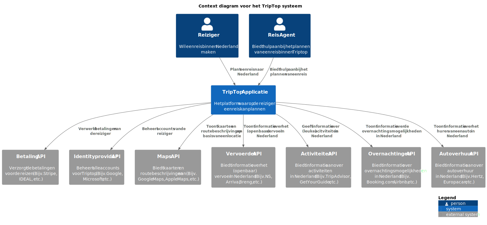
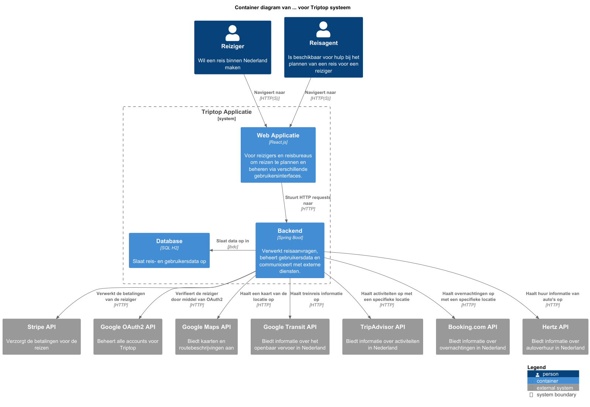
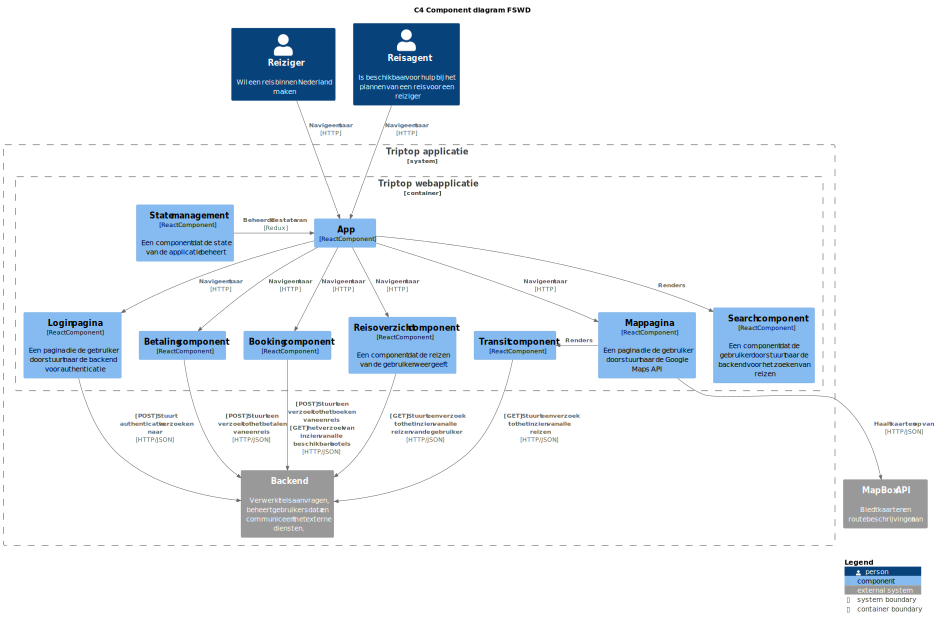
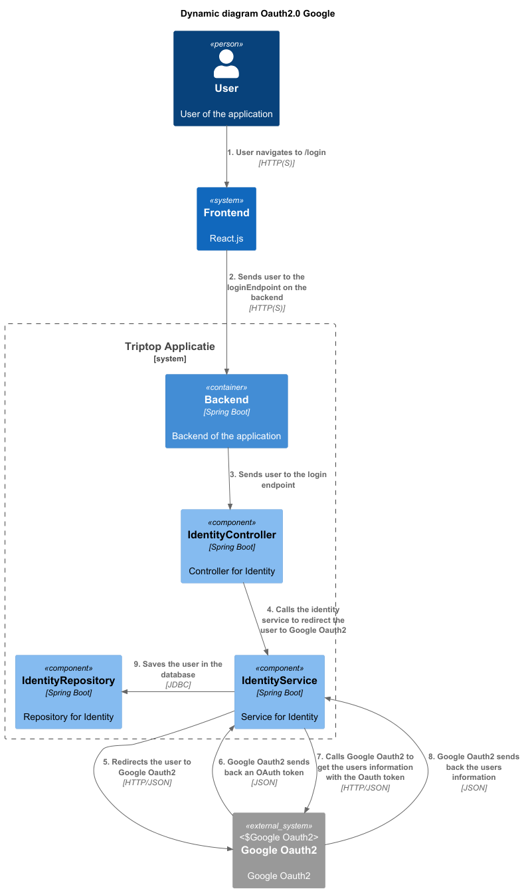

# Software Guidebook Triptop

## 1. Introduction

Dit software guidebook geeft een overzicht van de Triptop-applicatie. Het bevat een samenvatting van het volgende:

1. De vereisten, beperkingen en principes.
1. De software-architectuur, met inbegrip van de technologiekeuzes op hoog niveau en de structuur van de software.
1. De ontwerp- en codebeslissingen die zijn genomen om de software te realiseren.
1. De architectuur van de infrastructuur en hoe de software kan worden geinstalleerd.

## 2. Context

### Achtergrond

#### Waarom wordt deze software ontwikkeld?

TripTop zou graag deze software ontwikkeld willen zien om een exclusief standpunt in de Nederlandse markt te kunnen
innemen.
Triptop wil een reisplatform ontwikkelen waarbij de reiziger zelf een reis kan samenstellen. Triptop wil meegaan in de
trend van reizigers die zelf hun reis samenstellen én wil een unieke mogelijkheid bieden door, het
traditionele idee van het boeken bij een reisbureau te vervangen door een online platform waarbij een reiziger zelf een
reis kan samenstellen. Reizigers hebben hierdoor zelf meer controle over hoe ze hun reis indelen én plannen.

Triptop zou graag een software ontwikkeling willen ontvangen om in te kunnen spelen op de trend dat reizigers hun reis
bepalen én boeken. Reizigers kunnen zodra deze applicatie is ontwikkeld, zelf hun reis samenstellen, boeken, aanpassen,
annuleren én betalen. Hierdoor is geen tussenkomst van een reisbureau nodig. Wel wil Triptop de mogelijkheid aanbieden
voor tweedelijns ondersteuning voor reizigers die vastlopen op het plannen van hun reis.

Triptop is helaas niet de eerste die met dit idee is gekomen. Op de globale markt zijn er al een aantal partijen die een
reiziger deze mogelijkheden biedt, neem als voorbeeld [Ellipsis Travel](https://www.ellipsistravel.com/).

#### Wie zijn de doelgroep?

Triptop richt zich specifiek op de Nederlandse markt, in tegenstelling met Ellipsis. Triptop wil zich onderscheiden door
een unieke mogelijkheid te bieden voor reizigers om zelf hun reis samen te stellen. Hierdoor heeft Triptop als doelgroep
een brede groep reizigers die zelf hun reis / trip willen samenstellen.

### Context diagram

|  |
|--------------------------------------------------------------------------------------------- 
| Het context diagram                                                                         |

Zoals er in het context diagram te zien is, is de Triptop-applicatie het centrale punt van de software. De applicatie
heeft meerdere externe systemen waarmee het communiceert, deze sytemen zijn van belang voor het correct functioneren van
de Triptop-applicatie. De externe systemen waarvan de Triptop-applicatie afhankelijk zijn, zijn zichtbaar in het context
diagram. Hier wordt ook per extern systeem een korte uitleg gegeven wat deze inhoudt én enkele voorbeelden van externe
systemen.

> [!IMPORTANT]
> Werk zelf dit hoofdstuk uit met context diagrammen en een beschrijving van de context van de software.

#### Toelichting op de functionaliteit

#### Toelichting op de gebruikers

#### Externe systemen

In dit deelhoofdstuk wordt er een korte toelichting gegeven op de externe systemen die van belang zijn voor de
Triptop-applicatie. Hierbij worden enkele voorbeelden gegeven maar ook wat de verwachte functionaliteit van de externe
systemen zijn.

Toelichting op de context van de software inclusief System Context Diagram:

* Functionaliteit
* Gebruikers
* Externe systemen

## 3. Functional Overview

Om de belangrijkste features toe te lichten zijn er user stories en twee domain stories gemaakt en een overzicht van het
domein in de vorm van een domeinmodel. Op deze plek staat typisch een user story map maar die ontbreekt in dit
voorbeeld.

### 3.1 User Stories

#### 3.1.1 User Story 1: Reis plannen

Als gebruiker wil ik een zelfstandig op basis van diverse variabelen (bouwstenen) een reis kunnen plannen op basis van
mijn reisvoorkeuren (wel/niet duurzaam reizen, budget/prijsklasse, 's nachts reizen of overdag etc.) zodat ik op
vakantie kan gaan zonder dat hiervoor een reisbureau benodigd is.

#### 3.1.2 User Story 2: Reis boeken

Als gebruiker wil ik een geplande reis als geheel of per variabele (bouwsteen) boeken en betalen zodat ik op vakantie
kan gaan zonder dat hiervoor een reisbureau benodigd is.

#### 3.1.3 User Story 3: Reis cancelen

Als gebruiker wil ik een geboekte reis, of delen daarvan, kunnen annuleren zodat ik mijn geld terug kan krijgen zonder
inmenging van een intermediair zoals een reisbureau.

#### 3.1.4 User Story 4: Reisstatus bewaren

Als gebruiker wil ik mijn reisstatus kunnen bewaren zonder dat ik een extra account hoef aan te maken zodat ik mijn reis
kan volgen zonder dat ik daarvoor extra handelingen moet verrichten.

#### 3.1.5 User Story 5: Bouwstenen flexibel uitbreiden

Als gebruiker wil ik de bouwstenen van mijn reis flexibel kunnen uitbreiden met een zelf te managen stap (bijv. met
providers die niet standaard worden aangeboden zoals een andere reisorganisatie, hotelketen etc.) zodat ik mijn reis
helemaal kan aanpassen aan mijn wensen.

### 3.2 Domain Story Reis Boeken (AS IS)

### 3.3 Domain Story Reis Boeken (TO BE)

### 3.4 Domain Model

## 4. Quality Attributes

Voordat deze casusomschrijving tot stand kwam, heeft de opdrachtgever de volgende ISO 25010 kwaliteitsattributen benoemd
als belangrijk:

* Compatibility -> Interoperability (Degree to which a system, product or component can exchange information with other
  products and mutually use the information that has been exchanged)
* Reliability -> Fault Tolerance (Degree to which a system or component operates as intended despite the presence of
  hardware or software faults)
* Maintainability -> Modularity (Degree to which a system or computer program is composed of discrete components such
  that a change to one component has minimal impact on other components)
* Maintainability -> Modifiability (Degree to which a product or system can be effectively and efficiently modified
  without introducing defects or degrading existing product quality)
* Security -> Integrity (Degree to which a system, product or component ensures that the state of its system and data
  are protected from unauthorized modification or deletion either by malicious action or computer error)
* Security -> Confidentiality (Degree to which a system, product or component ensures that data are accessible only to
  those authorized to have access)

## 5. Constraints

> [!IMPORTANT]
> Beschrijf zelf de beperkingen die op voorhand bekend zijn die invloed hebben op keuzes die wel of niet gemaakt kunnen
> of mogen worden.

### Het project

Hier worden algemene constraints benoemd binnen het project.

#### Proof of concept

Het project loopt van 31-03-2025 tot 04-04-2025, waarbij de laatste week gericht is op het bouwen van functionaliteit.
Deze korte tijdsduur beperkt de hoeveelheid functionaliteit die uitgewerkt kan worden. Het eindresultaat is een proof of
concept, zodat mogelijke uitdagingen en sterke punten gevonden kunnen worden.

De front-end valt buiten de scope van dit project. De focus ligt op de back-end, waarbij de prototypes specifiek hierop
gericht zullen zijn.

#### Integratie tussen prototypes

Door de korte tijdsduur is volledige integratie mogelijk niet haalbaar.

#### Teamgrootte

Het team bestaat uit 4 leden, bestaande uit studenten:

- Julius Morselt
- Thieme Wijgman
- Bryan Velthuizen
- Daniel Sung

Dit beperkt de mogelijke functionaliteit die gebouwd kan worden

### De applicatie

Hier worden de constraints binnen de applicatie benoemd.

#### Database

De gekozen database is een H2-database, een in-memory database. Het nadeel hiervan is dat de gegevens verloren gaan
wanneer de applicatie stopt, tenzij we ze expliciet in een bestand opslaan. Dit kan de persistentie beperken in een
applicatie die voor het publiek beschikbaar moet zijn.

#### Afhankelijkheid van externe systemen

De applicatie "TripTop" maakt gebruik van externe API's om informatie over reizen, vervoersmogelijkheden en kaarten op
te halen. Bij een storing in deze systemen zijn deze functionaliteiten niet meer beschikbaar.

#### Transportmiddelen

De vervoermogelijkheden binnen de applicatie richten zich voornamelijk op auto's, treinen en bussen. Vliegtuigen, boten
en andere transportmiddelen zijn niet relevant voor deze applicatie.

#### Locatie

De applicatie is ontwikkeld om exclusief in Nederland te werken en is niet toegankelijk buiten Nederland.

## 6. Principles

> [!IMPORTANT]
> Beschrijf zelf de belangrijkste architecturele en design principes die zijn toegepast in de software.

## 7. Software Architecture

### 7.1. Containers

#### 7.1.1 Dynamic Diagram 1: Inloggen

> [!IMPORTANT]
> Voeg toe: Container Diagram plus een Dynamic Diagram van een aantal scenario's inclusief begeleidende tekst.

### 7.2. Components

#### 7.2.1. Frontend component diagram

> [!IMPORTANT]
> Voeg toe: Component Diagram plus een Dynamic Diagram van een aantal scenario's inclusief begeleidende tekst.

#### 7.2.2 Backend component diagram

#### 7.2.3. Dynamic diagram 2: Google Oauth2

### 7.3. Design & Code

> [!IMPORTANT]
> Voeg toe: Per ontwerpvraag een Class Diagram plus een Sequence Diagram van een aantal scenario's inclusief
> begeleidende tekst.

## 8. Architectural Decision Records

> [!IMPORTANT]
> Voeg toe: 3 tot 5 ADR's die beslissingen beschrijven die zijn genomen tijdens het ontwerpen en bouwen van de software.

### 8.1. ADR-001 Api Descesion Making

#### Context

Wij willen ervoor zorgen dat de eindgebruiker een interactieve map tot zijn of haar beschikking heeft.

#### Considered Options

| Eigenschap | Google Maps | Mapbox |
|------------|-------------|--------|
| Limiet     | --          | ++     |
| Per uur    | --          | +      |
| Kosten     | ++          | ++     |

#### Decision

Om er voor te zorgen dat de gebruiker op zijn huidige locatie een map heeft om de omgeving te verkenning, gebruiken wij
de Mapbox API om deze map in te laden. Het limiet van de gratis tiel is 50.000 requests per uur.

#### Status

Accepted

#### Consequences

De voordelen van Mapbox tegenover Google Maps: Mapbox bied een breede variatie aan verschillende mappen. Ook kun je veel
verzoeken doen op de free tier. De code snippets zijn ook straight forward.

De nadelen van Mapbox tegenover Google Maps: Mapbox
heeft [veel verschillende api's om verschillende dingen aan te vragen](https://www.mapbox.com/pricing). Verder zijn er
geen nadelen.

### 8.2. ADR-002: Identity provider API keuze

Datum: 21-03-2025

##### Status

Accepted

##### Context

Er moet een identityprovider komen voor de triptop website. Deze moet moet dus een inlog functie hebben. Het is meer
werk om zelf een loginsyteem te maken vergeleken met bestaande API’s zoals Google Oauth2, Microsoft Oauth2 of Discord
Oauth2.

##### Considered Options

| Forces                 | Google Oauth2 | Microsoft Oauth2 | Discord Oauth2 |
|------------------------|---------------|------------------|----------------|
| Populariteit           | ++            | +                | +`*`           |
| Gebruikers informatie  | ++            | +                | -              |
| Beveiliging            | ++            | ++               | 0 `**`         | 
| Eenvoudige intergratie | +             | 0                | ++             |
| Kosten                 | 0             | 0                | +              |

`*` -> Populair onder mensen die gebruik maken van discord, alleen ligt bij deze casus buiten de scope.
`**` -> Geschikter voor informele authenticatie, mist geavanceerde beveiligingsmaatregelen.

##### Decision

Het gebruik van een identity provider moet goed beveiligd zijn voor een productie-applicatie. Tevens omdat het team nu
aan het kijken is naar het maken van prototypes ligt beveiliging nu op een lager pitje, maar deze wordt niet vergeten.
Doordat Google over het algemeen populairder is vergeleken met Discord en Microsoft is de keuze van het team geworden
dat Google de identityprovider van Triptop wordt.

##### Consequences

* Bij het veranderen van de scope naar een professionelere setting dan een Reisboekings applicatie wordt het door het
  team aangeraden om te veranderen van Google Oauth2 naar Microsoft Oauth2.

### 8.3. ADR-003: Gebruik van public transit API

##### Status

Accepted

##### Context

Voor ons project hebben we een API nodig die openbaar vervoersgegevens kan leveren, zoals dienstregelingen en routes.

##### Considered Options

| Force                             | Google Transit API | NS API | 9292 API |
|-----------------------------------|--------------------|--------|----------|
| **Dekking**                       | ++                 | -      | +        |
| **Realtime data**                 | ++                 | +      | +        |
| **Kosten**                        | -                  | 0      | 0        |
| **Gebruiksgemak**                 | ++                 | +      | +        |
| **Integratiemogelijkheden**       | ++                 | +      | 0        |
| **Ondersteuning en documentatie** | ++                 | +      | -        |
| **Schaalbaar**                    | ++                 | +      | 0        |
| **Nederland-specifieke data**     | 0                  | ++     | ++       |

##### Decision

We hebben gekozen voor Google Transit, omdat wij hier de meeste voordelen in zien. Het is niet specifiek voor
Nederlandse data, maar werkt wel goed in Nederland. Met zicht op de toekomst is dit ook de meest schaalbare API voor
eventuele internationale ambities. Het is ook de API met de meeste dekking, de beste realtime data, het meest
gebruiksvriendelijk en met de meeste integratiemogelijkheden en documentatie.

##### Consequences

Het gevolg van het kiezen van deze API is dat we gemakkelijk routes met het OV kunnen voorstellen. Aangezien we ook de
Google Maps API gebruiken, kan dit goed samenwerken met elkaar. Je kan hierdoor een route invullen en dan de daarbij
horende OV-mogelijkheden bekijken.

### 8.4. ADR-004: Database

##### Context

Er moet een database worden gekozen voor de TripTop applicatie, het moet voor een PoC zijn. Hierin worden
gebruikersgegevens/reisinformatie opgeslagen worden.

##### Considered Options

| **Forces**            | Microsoft SQL | No-SQL | H2 in memory |
|-----------------------|---------------|--------|--------------|
| Eenvoudigheid         | +             | +      | +            |
| Snelheid              | -             | +      | ++           |
| Ease of development   | 0             | 0      | +            |
| Ervaring met database | ++            | 0      | ++           |

##### Decision

Na een teams-call besloten we te kiezen voor de H2 in memory database. We hebben hiervoor gekozen omdat we allemaal
gewend zijn aan SQL. Ook is het in memory, wat developen makkelijker maakt. Gegevens worden gewist na afsluiten van de
applicatie. Persistentie is ook niet nodig, het is puur voor een PoC applicatie.

##### Status

Accepted

##### Consequences

De gekozen database is in-memory, waardoor deze niet geschikt is voor een volledige applicatie in de praktijk. Dit is
nadelig als de PoC uitgewerkt wordt. Het voordeel is dat het ontwikkelen van de applicatie versneld, doordat gegevens
worden gewist na het opnieuw opstarten van de applicatie.

### 8.5. ADR-005: Design pattern keuze 1: Strategy

#### Status

Accepted

#### Context

Bij het ontwikkelen van de Triptop applicatie zijn we afhankelijk van externe services, zoals Google, Stripe, etc. Door
wijzigingen in de API van deze services kan het zo zijn dat er aanzienlijke aanpassingen gedaan moeten worden aan de
applicatie. Met name in de architectuur zoals we het nu hebben opgezet (Frontend - Backend) kan een verandering in bijv.
de Google Oauth API impact hebben op de frontend als de backend deze wijziging niet opvangt.

Om de impact hiervan te minimaliseren en flexibiliteit in de backend te waarborgen, is er een design pattern nodig dat
de API-interacties loskoppelt van de interne logica en de frontend.

#### Considered Options

| Forces                                                                       | Strategy Pattern | Adapter Pattern | Observer Pattern |
|------------------------------------------------------------------------------|------------------|-----------------|------------------|
| Flexibiliteit; Hoe past het patroon zich aan bij API-wijzigingen?            | ++               | +               | ++               |
| Onderhoudbaarheid; Hoe eenvoudig is het om uitbreidingen te maken?           | +                | ++              | +                |  
| Complexiteit; Hoeveel extra code en beheer is er nodig?                      | -                | 0               | -                |
| Runtime-selectie; Ondersteunt het een dynamische selectie van implementaties | ++               | -               | ++               |

#### Decision

Het Strategy Pattern is gekozen omdat het de meeste flexibiliteit biedt en de onderhoudbaarheid van de code bevordert.
Het Strategy Pattern zorgt ervoor dat de API-interacties losgekoppeld worden van de interne logica en de frontend. Dit
maakt het mogelijk om de API-interacties te wijzigen zonder dat de frontend hier iets van merkt. De backend kan
dynamisch de juiste implementatie kiezen op basis van de configuratie.

#### Consequences

* Verhoogde flexibiliteit en minder impact bij API-wijzigingen.
* Extra complexiteit in het beheren van strategieën en configuraties.

## 9. Deployment, Operation and Support

> [!TIP]
> Zelf beschrijven van wat je moet doen om de software te installeren en te kunnen runnen.