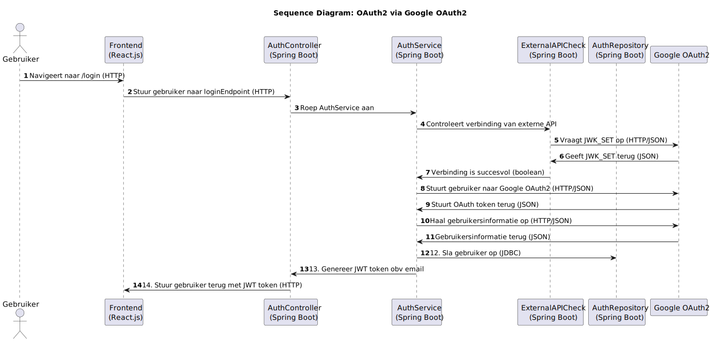
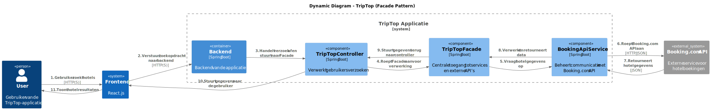
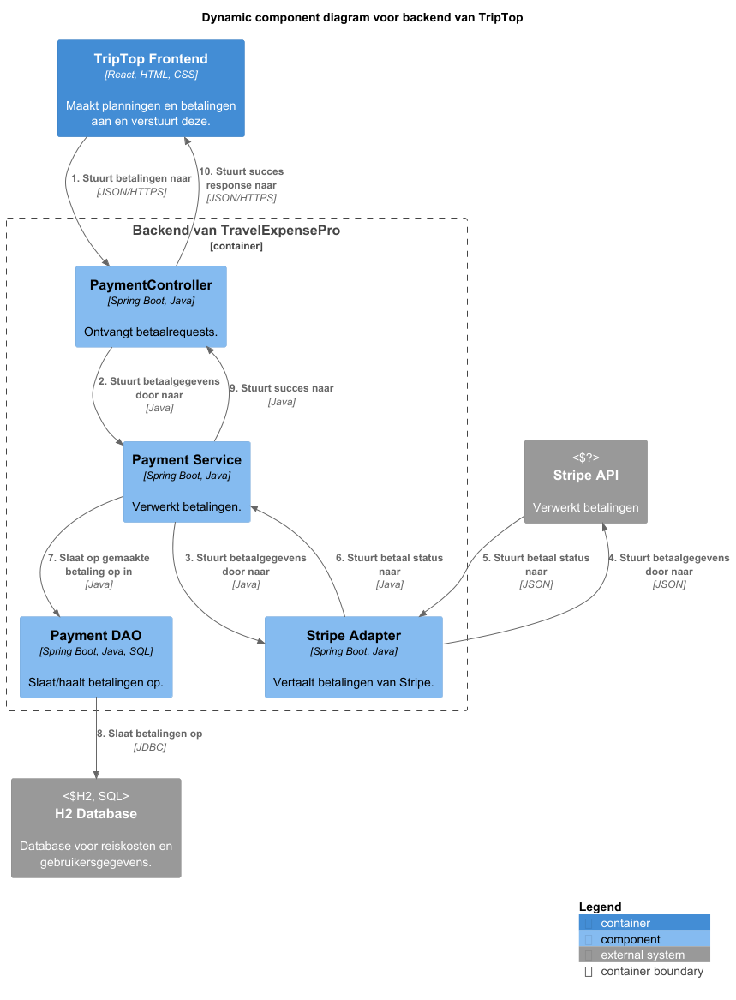

# Software Guidebook Triptop

## 1. Introduction

Dit software guidebook geeft een overzicht van de Triptop-applicatie. Het bevat een samenvatting van het volgende:

1. De vereisten, beperkingen en principes.
1. De software-architectuur, met inbegrip van de technologiekeuzes op hoog niveau en de structuur van de software.
1. De ontwerp- en codebeslissingen die zijn genomen om de software te realiseren.
1. De architectuur van de infrastructuur en hoe de software kan worden geinstalleerd.

## 2. Context

### Achtergrond

#### Waarom wordt deze software ontwikkeld?

TripTop zou graag deze software ontwikkeld willen zien om een exclusief standpunt in de Nederlandse markt te kunnen
innemen.
Triptop wil een reisplatform ontwikkelen waarbij de reiziger zelf een reis kan samenstellen. Triptop wil meegaan in de
trend van reizigers die zelf hun reis samenstellen én wil een unieke mogelijkheid bieden door, het
traditionele idee van het boeken bij een reisbureau te vervangen door een online platform waarbij een reiziger zelf een
reis kan samenstellen. Reizigers hebben hierdoor zelf meer controle over hoe ze hun reis indelen én plannen.

Triptop zou graag een software ontwikkeling willen ontvangen om in te kunnen spelen op de trend dat reizigers hun reis
bepalen én boeken. Reizigers kunnen zodra deze applicatie is ontwikkeld, zelf hun reis samenstellen, boeken, aanpassen,
annuleren én betalen. Hierdoor is geen tussenkomst van een reisbureau nodig. Wel wil Triptop de mogelijkheid aanbieden
voor tweedelijns ondersteuning voor reizigers die vastlopen op het plannen van hun reis.

Triptop is helaas niet de eerste die met dit idee is gekomen. Op de globale markt zijn er al een aantal partijen die een
reiziger deze mogelijkheden biedt, neem als voorbeeld [Ellipsis Travel](https://www.ellipsistravel.com/).

#### Wie zijn de doelgroep?

Triptop richt zich specifiek op de Nederlandse markt, in tegenstelling met Ellipsis. Triptop wil zich onderscheiden door
een unieke mogelijkheid te bieden voor reizigers om zelf hun reis samen te stellen. Hierdoor heeft Triptop als doelgroep
een brede groep reizigers die zelf hun reis / trip willen samenstellen.

### Context diagram

|  |
|---------------------------------------------------------------------------------------------
| Het context diagram |

#### Toelichting op het context diagram

In het diagram valt te zien hoe het Triptop-systeem in elkaar zit. Het systeem bestaat uit de Triptop-applicatie, die de
centrale rol speelt in het systeem. De Triptop-applicatie communiceert met verschillende externe systemen, die van
belang
zijn voor het correct functioneren van de Triptop-applicatie. De applicatie biedt meerdere functionaliteiten aan voor
gebruikers die binnen Nederland willen reizen. De belangrijkste functionaliteiten die het systeem biedt worden hieronder
benoemd:

- Reizen plannen: Gebruikers kunnen een reis smanestellen met transport, activiteiten, overnachtingen en autoverhuur.
- Betalingen verwerken: Voor bepaalde services kunnen betalingen worden gedaan via externe providers zoals Stripe of
  IDeal.
- Gebruikersbeheer: Accountbeheer gebeurt via een externe identity provider. Neem als voorbeeld Google, Microsoft of
  Discord.
- Informatie ophalen: Informatie over reizen, vervoersmogelijkheden en kaarten worden opgehaald via de externe systemen
  zoals Google Maps, Google Transit, 9292 en NS.

Voor het Triptop systeem worden 2 soorten gebruikers onderscheiden, beide gebruikers maken gebruik van het systeem maar
op een andere manier, hieronder wordt dit kort beschreven:

- Reiziger
  - De reiziger is de eindgebruiker van het systeem. De reiziger kan een reis samenstellen, boeken, betalen, annuleren
    en de reisstatus bewaren. De reiziger kan ook de bouwstenen van de reis flexibel uitbreiden.
- Reisagent
  - De reisagent is een tweedelijns ondersteuning voor reizigers die vastlopen op het plannen van hun reis via
    Triptop. De reisagent kan de reiziger helpen met het plannen van de reis.

Beide gebruikers hebben toegang tot de Triptop-applicatie, maar hun precieze rechten en rollen verschillen.

Om dit alles correct te laten functioneren maakt Triptop gebruik van externe systemen zoals Google Maps. Hieronder volgt
een kort lijstje over de meest belangrijkste Externe systemen die worden gebruikt:

- Betalings API: Verwerkt betalingen voor de reizen (bijv. via Stripe of iDEAL).
- Identityprovider API: Beheert gebruikersaccounts (bijv. Google, Microsoft of Discord).
- Maps API: Biedt kaarten, locaties en routebeschrijvingen aan (bijv. Google Maps of Apple Maps).

> [!IMPORTANT]
> // TODO DIT HIERONDER VERWIJDEREN

> Werk zelf dit hoofdstuk uit met context diagrammen en een beschrijving van de context van de software.
>
> In dit deelhoofdstuk wordt er een korte toelichting gegeven op de externe systemen die van belang zijn voor de
> Triptop-applicatie. Hierbij worden enkele voorbeelden gegeven maar ook wat de verwachte functionaliteit van de externe
> systemen zijn.

> Toelichting op de context van de software inclusief System Context Diagram:

> - Functionaliteit
> - Gebruikers
> - Externe systemen

> // EINDE TODO---------------------------------------

## 3. Functional Overview

Om de belangrijkste features toe te lichten zijn er user stories en twee domain stories gemaakt en een overzicht van het
domein in de vorm van een domeinmodel. Op deze plek staat typisch een user story map maar die ontbreekt in dit
voorbeeld.

### 3.1 User Stories

#### 3.1.1 User Story 1: Reis plannen

Als gebruiker wil ik een zelfstandig op basis van diverse variabelen (bouwstenen) een reis kunnen plannen op basis van
mijn reisvoorkeuren (wel/niet duurzaam reizen, budget/prijsklasse, 's nachts reizen of overdag etc.) zodat ik op
vakantie kan gaan zonder dat hiervoor een reisbureau benodigd is.

#### 3.1.2 User Story 2: Reis boeken

Als gebruiker wil ik een geplande reis als geheel of per variabele (bouwsteen) boeken en betalen zodat ik op vakantie
kan gaan zonder dat hiervoor een reisbureau benodigd is.

#### 3.1.3 User Story 3: Reis cancelen

Als gebruiker wil ik een geboekte reis, of delen daarvan, kunnen annuleren zodat ik mijn geld terug kan krijgen zonder
inmenging van een intermediair zoals een reisbureau.

#### 3.1.4 User Story 4: Reisstatus bewaren

Als gebruiker wil ik mijn reisstatus kunnen bewaren zonder dat ik een extra account hoef aan te maken zodat ik mijn reis
kan volgen zonder dat ik daarvoor extra handelingen moet verrichten.

#### 3.1.5 User Story 5: Bouwstenen flexibel uitbreiden

Als gebruiker wil ik de bouwstenen van mijn reis flexibel kunnen uitbreiden met een zelf te managen stap (bijv. met
providers die niet standaard worden aangeboden zoals een andere reisorganisatie, hotelketen etc.) zodat ik mijn reis
helemaal kan aanpassen aan mijn wensen.

### 3.2 Domain Story Reis Boeken (AS IS)


### 3.3 Domain Story Reis Boeken (TO BE)


### 3.4 Domain Model


## 4. Quality Attributes

Voordat deze casusomschrijving tot stand kwam, heeft de opdrachtgever de volgende ISO 25010 kwaliteitsattributen benoemd
als belangrijk:

- Compatibility -> Interoperability (Degree to which a system, product or component can exchange information with other
  products and mutually use the information that has been exchanged)
- Reliability -> Fault Tolerance (Degree to which a system or component operates as intended despite the presence of
  hardware or software faults)
- Maintainability -> Modularity (Degree to which a system or computer program is composed of discrete components such
  that a change to one component has minimal impact on other components)
- Maintainability -> Modifiability (Degree to which a product or system can be effectively and efficiently modified
  without introducing defects or degrading existing product quality)
- Security -> Integrity (Degree to which a system, product or component ensures that the state of its system and data
  are protected from unauthorized modification or deletion either by malicious action or computer error)
- Security -> Confidentiality (Degree to which a system, product or component ensures that data are accessible only to
  those authorized to have access)

## 5. Constraints

> [!IMPORTANT]
> Beschrijf zelf de beperkingen die op voorhand bekend zijn die invloed hebben op keuzes die wel of niet gemaakt kunnen
> of mogen worden.

### Het project

Hier worden algemene constraints benoemd binnen het project.

#### Proof of concept

Het project loopt van 31-03-2025 tot 04-04-2025, waarbij de laatste week gericht is op het bouwen van functionaliteit.
Deze korte tijdsduur beperkt de hoeveelheid functionaliteit die uitgewerkt kan worden. Het eindresultaat is een proof of
concept, zodat mogelijke uitdagingen en sterke punten gevonden kunnen worden.

Het project loopt van 31-03-2025 tot 04-04-2025, waarbij de laatste week gericht is op het bouwen van functionaliteit.
Deze korte tijdsduur beperkt de hoeveelheid functionaliteit die uitgewerkt kan worden. Het eindresultaat is een proof of
concept, zodat mogelijke uitdagingen en sterke punten gevonden kunnen worden.

De front-end valt buiten de scope van dit project. De focus ligt op de back-end, waarbij de prototypes specifiek hierop
gericht zullen zijn.

#### Integratie tussen prototypes

Door de korte tijdsduur is volledige integratie mogelijk niet haalbaar.

#### Teamgrootte

Het team bestaat uit 4 leden, bestaande uit studenten:

- Julius Morselt
- Thieme Wijgman
- Bryan Velthuizen
- Daniel Sung

Dit beperkt de mogelijke functionaliteit die gebouwd kan worden

### De applicatie

Hier worden de constraints binnen de applicatie benoemd.

#### Database

De gekozen database is een H2-database, een in-memory database. Het nadeel hiervan is dat de gegevens verloren gaan
wanneer de applicatie stopt, tenzij we ze expliciet in een bestand opslaan. Dit kan de persistentie beperken in een
applicatie die voor het publiek beschikbaar moet zijn.

#### Afhankelijkheid van externe systemen

De applicatie "TripTop" maakt gebruik van externe API's om informatie over reizen, vervoersmogelijkheden en kaarten op
te halen. Bij een storing in deze systemen zijn deze functionaliteiten niet meer beschikbaar.

#### Transportmiddelen

De vervoermogelijkheden binnen de applicatie richten zich voornamelijk op auto's, treinen en bussen. Vliegtuigen, boten
en andere transportmiddelen zijn niet relevant voor deze applicatie.

#### Locatie

De applicatie is ontwikkeld om exclusief in Nederland te werken en is niet toegankelijk buiten Nederland.

## 6. Design principles

## Inleiding

Design principles zijn erg belangrijk binnen een project in software development. Het bevat de fundamentele regels waar
iedereen in het project aan vast kan houden. Zo verminder je de kans op onleesbare inconsitente code. Door afspraken te
maken blijft de code voor iedereen leesbaar en kan iedereen
zo snel mogelijk bugs achterhalen. Dit verminderd dus ook de kans op bugs. De code blijft consistent en net.

## 6.1 KISS(Keep It Simple, Stupid)

KISS oftewel Keep It Simple, Stupid is één van de meest belangrijke design principles die we hanteren. Deze vinden we
belangrijk, omdat we te maken hebben met prototypes. Het moet allemaal niet te complex worden, maar juist simpel en
functioneel zodat we puur kunnen testen of de API naar wens werkt.
Bij het gebruik van KISS proberen we de oplossing dus de eenvoudig mogelijk te houden dus "Less is more".

## 6.2  YAGNI (You Aren't Gonna Need It)

We hebben er ook voor gekozen YAGNI (You Aren't Gonna Need It) te hanteren. Dit sluit goed aan bij het simpel houden van
de applicatie. Bij dit principe hanteer je namelijk dat je geen functionaliteiten gaat maken die we niet binnenkort
nodig hebben. Dit zorgt ervoor dat we de applicatie simpel kunnen
houden.

## 6.3 Separation of Concerns (SoC)

Bij Separation of Concerns (SoC) zorg je ervoor dat het systeem verdeelt wordt over verschillende onderdelen. Elk deel
richt zich op één specifiek aspect van de functionaliteit. Dit maakt het systeem makkelijker te begrijpen, te
onderhouden en uit te breiden.

## 7. Software Architecture

### 7.1. Containers

|  |
|---------------------------------------------------------------------------------------------------------|
| Container Diagram van Triptop systeem                                                                   |

In het diagram kunnen eventuele onzekerheden onstaan als je niet bekend bent met het systeem. Hieronder worden de
onzekerheden en eventuele vragen beantwoord om een betere beeld te geven van het systeem.

| Vraag                                                                              | Antwoord                                                                                                                                                               |
|------------------------------------------------------------------------------------|------------------------------------------------------------------------------------------------------------------------------------------------------------------------|
| Hoe communiceert de webapplicatie met de backend?                                  | De webapplicatie verstuurt HTTP-verzoeken naar de backend door middel van een REST API. Hierna regelt de backend het ophalen van gegevens.                             |
| Wordt de H2 database gebruikt voor productie?                                      | Nee. De H2 database is een in-memory database die alleen gebruikt wordt voor het Proof of Concept (PoC). De gegevens worden gewist na het afsluiten van de applicatie. |
| Wordt er gebruik gemaakt van caching om een overmaat aan API-gebruik te voorkomen? | Nee, er wordt niet gebruik gemaakt van een caching systeem. Dit doordat de uitgewerkte code een PoC is en dus niet gebruikt wordt op een productie server.             | 

#### 7.1.1 Dynamic Diagram 1: Inloggen


> [!IMPORTANT]
> Voeg toe: Container Diagram plus een Dynamic Diagram van een aantal scenario's inclusief begeleidende tekst.

### 7.2. Components

#### 7.2.1. Frontend component diagram


> [!IMPORTANT]
> Voeg toe: Component Diagram plus een Dynamic Diagram van een aantal scenario's inclusief begeleidende tekst.

#### 7.2.2 Backend component diagram


#### 7.2.3. Dynamic diagram 2: Google Oauth2


### 7.3. Design & Code

#### Ontwerpvragen

Voor het ontwerp van de software zijn de volgende ontwerpvragen opgesteld, deze vragen worden per deelhoofdstuk
uitgewerkt. Hieronder volgt een lijstje met de ontwerpvragen per student/developer:

| Student/Developer | Ontwerpvraag                                                                                                                                                                                                                                                                                      | Design Pattern | Uitwerkingshoofdstuk |
| ----------------- | ------------------------------------------------------------------------------------------------------------------------------------------------------------------------------------------------------------------------------------------------------------------------------------------------- | -------------- | -------------------- |
| Julius Morselt    | Hoe kunnen we dynamisch beslissen of een bouwsteen geboekt moet worden via een externe service of intern beheerd moet worden?                                                                                                                                                                     | Factory        | 7.3.1                |
| Thieme Wijgman    | Hoe zorg je dat een wijziging in een of meerdere API's niet leidt tot een grote wijziging in de applicatie? Specifieker: hoe zorg je ervoor dat een wijziging in de API van een externe service niet leidt tot een wijziging in de front-end maar flexibel kan worden opgevangen door de backend. | Strategy       | 7.3.2                |
| Bryan Velthuizen  | Wie roept een specifieke externe service aan, gebeurt dat vanuit de front-end of vanuit de backend? Welke redenen zijn er om voor de ene of de andere aanpak te kiezen?                                                                                                                           | Facade         | 7.3.3                |
| Daniel Sung       | Hoe ga je om met het aanroepen van externe services die niet beschikbaar zijn en toch verwacht dat er waardevolle output gegeven wordt?                                                                                                                                                           | Adapter        | 7.3.4                |

##### 7.3.1. Uitwerking Ontwerpvraag Julius Morselt

[Klassediagram Julius Morselt]()

> [IMPORTANT]
> INDIEN NODIG KUN JE HIERONDER EEN SEQUENTIEDIAGRAM TOEVOEGEN
> [Sequentiediagram Julius Morselt]()

##### 7.3.2. Uitwerking Ontwerpvraag Thieme Wijgman

|  |
|-----------------------------------------------------------------------------------|
| Het verbeterde klasse diagram van Thieme.                                         |

Hierboven is mijn klasse diagram te zien. Hierin zitten alle klasses waar ik de code heb uitgewerkt. Hieronder zou ik
mijn eerste versie weergeven.

|  |
|-----------------------------------------------------------------------------------------------------|
| De eerste versie klassendiagram van Thieme.                                                         |

Om een helderder beeld te geven van de functionaliteit van mijn prototype en een klein beeld welke data deze nodig heeft
heb ik een sequentie diagram gemaakt. Dit diagram laat zien hoe de data door de applicatie heen gaat en welke
functionaliteit er aan te pas komt.

|                                  |
|--------------------------------------------------------------------------------------------------------------------|
|  |
| Het sequentiediagram van Thieme.                                                                                   |

###### Antwoord op mijn ontwerpvraag

Om mijn ontwerpvraag`*` te beantwoorden heb ik ervoor gekozen om 2 API's te gebruiken voor het authoriseren van
gebruikers.
Deze API's zijn Google en Discord. Dit staat tevens al beschreven in een ADR waarom er voor deze API's zijn gekozen.

Voor het beantwoorden van mijn ontwerpvraag heb ik gekozen voor het design pattern Strategy (uitgelegd in ADR ...), de
reden waarvoor ik deze heb gekozen is omdat deze goed aansluit op mijn ontwerpvraag. Het flexibel opvangen van een
wijziging in een API. In het sequentie diagram hierboven kunt u de 2 manieren van Oauth beknopt zien. De gebruiker logt
in via de normale route, maar voordat deze wordt doorgestuurd naar de daadwerkelijke login pagina van de betreffende API
wordt er eerst bekeken of deze API beschikbaar is. Indien deze niet beschikbaar is wordt de gebruiker overgeplaatst naar
de 2e Oauth API (Discord). Doordat er gebruik wordt gemaakt van een strategy interface kan de backend flexibel te werk
gaan met het afhandelen van een API wijziging.

`*` -> Mijn ontwerpvraag: Hoe zorg je dat een wijziging in een of meerdere API's niet leidt tot een grote wijziging in
de applicatie? Specifieker: hoe zorg je ervoor dat een wijziging in de API van een externe service niet leidt tot een
wijziging in de front-end maar flexibel kan worden opgevangen door de backend.

##### 7.3.3. Uitwerking Ontwerpvraag Bryan Velthuizen

|  |
|-------------------------------------------------------------------------------------------------------|
| Het verbeterde klasse diagram van Bryan.                                                              |

Hierboven is mijn klasse diagram te zien. Hierin zitten alle klasses waar ik de code heb uitgewerkt. Hieronder zou ik
mijn eerste versie weergeven.

|  |
|-------------------------------------------------------------------------------------------------------|
| De eerste versie klassendiagram van Bryan.                                                            |

Om een beter beeld te geven van de onderlinge interactie heb ik ook nog een dynamic diagram gemaakt. Die ziet er als
volgt uit.

|  |
|----------------------------------------------------------------------------------------------------------|
| Final version van dynamic diagram                                                                        |

Hierboven is mijn dynamic diagram te zien.

|  |
|----------------------------------------------------------------------------------------------------------|
| De 1e versie van mijn dynamic diagram voor uitwerken code                                                |

Om nog beter in te gaan over interacties voor begrip van mijn code heb ik een sequentie diagram gemaakt. Deze zien er alsvolgt uit.

Om nog beter in te gaan over interacties voor begrip van mijn code heb ik een sequentie diagram gemaakt. Deze zien er
alsvolgt uit.

|  |
|--------------------------------------------------------------------------------------------------------------|
| De eerste versie sequentie diagram van Bryan.                                                                |

Hierboven is mijn sequentie diagram uitgewerkt.

|  |
|--------------------------------------------------------------------------------------------------------------|
| De eerste versie sequentie diagram van Bryan.                                                                |

Mijn ontwerpvraag was: Wie roept een specifieke externe service aan, gebeurt dat vanuit de front-end of vanuit de back-end? Welke redenen zijn er om voor de ene of de andere aanpak te kiezen?

Om mijn ontwerpvraag te beantwoorden heb ik ervoor gekozen om een facade pattern te gebruiken. Dit is een design pattern die
een interface biedt voor een complex subsysteem. Dit maakt het makkelijker om met dat subsysteem te werken zoals bijvoorbeeld
de BOOKING.com API.

Ik heb een ADR geschreven waarin ik uitleg waarom ik voor dit design pattern heb gekozen. Het is een 
handig design pattern om mee te werken als je gebruik maakt van externe API's.

### Booking naar backend of frontend

#### Context
Booking is een applicatie die het mogelijk maakt om een hotelkamer te boeken. De vraag is of de api via de frontend of backend moet lopen.

#### Considered Options
| Criteria                     | Frontend | Backend |
|------------------------------|----------|---------|
| **Beveiliging**              | -        | ++      |
| **Controle en validatie**    | 0        | ++      |
| **Prestaties (Latency)**     | ++       | -       |
| **Schaalbaarheid**          | -        | ++      |
| **Makkelijk te beheren**     | 0        | +       |
| **Complexiteit**            | +        | 0       |
| **Netwerkverkeer**          | ++       | 0       |
| **Schaalbaarheid**          | -        | ++      |

#### Decision
Backend-aanroepen is voor ons de beste keuze omdat we het beheren van externe services vooral via de backend willen laten lopen, omdat het soms complexe logica vereisen of we informatie willen opslaan in eigen database.

#### Consequences
De gevolgen van deze beslissing zijn dat we de API-aanroepen via de backend moeten laten lopen. Dit biedt meer controle over de gegevens en betere beveiliging door exceptions etc.

|--------------------------------------------------------------------------------------------------------------|

##### 7.3.4. Uitwerking Ontwerpvraag Daniel Sung

**Ontwerpvraag:** Hoe ga je om met het aanroepen van externe services die niet beschikbaar zijn en toch verwacht dat er waardevolle output gegeven wordt?

**Design pattern:** Adapter

**Prototype:** Betalingssysteem met Stripe API

###### Diagrammen van de betalingssysteem

PUML voor de diagrammen staat in: [triptop-groep-b6\huiswerk\gemaakte-werk-daniel\diagrammen](triptop-groep-b6\huiswerk\gemaakte-werk-daniel\diagrammen)

**Klassendiagram Daniel Sung**


De "Currencies" enum wordt alleen gebruikt voor valideren van een Payment.
STRIPE_API_KEY wordt opgehaald via een .env, het staat dus niet hardcoded.

**Sequence diagram Daniel Sung**

De controller hoort alleen de "pay" functie aan te roepen, dit checkt dan ook voor validatie en voert daarna de handlePaymentRequest aan.
Alleen response met 200 als HTTP status worden gezien als een succesresponse. Ook alleen daarbij worden gegevens opgeslagen in de H2 database.


**Component diagram Daniel Sung**


**Dynamic component diagram Daniel Sung**


###### Uitwerking van Design Pattern "Adapter"
De adapter pattern past goed bij mijn ontwerpvraag omdat ik fouten moet afhandelen van externe services. Met een adapter kan ik de externe service vertalen naar iets dat mijn systeem begrijpt. Zo wordt het eenvoudiger om de service aan te roepen en om te gaan met de responses.

Om de Adapter design pattern te gebruiken, heb ik een adapter klasse aangemaakt die POST requests specifiek voor Stripe uitvoert gemaakt. De StripeAdapter klasse implementeert een interface "PaymentAdapterInterface". Dit wordt dan gebruikt in mijn PaymentService. 

PaymentService weet dus niet hoe de Stripe API werkt, dit zorgt ook nog voor loose coupling en seperation of concerns.

Hieronder staan code voorbeelden met wat commentaar als toelichting:

**PaymentService**
Deze klasse maakt gebruik van de Stripe Adapter om een betaling te maken. Heeft geen communicatie met de Stripe API en maakt gebruik van een adapter om dit te doen.
```java
//com/prototype/triptop/service/PaymentService.java

@Service
public class PaymentService {

    //Hier wordt een adapter aangemaakt
    private PaymentAdapterInterface adapter = new StripeAdapter();
    private PaymentDAO paymentDAO;
    private AuthService authService;

    //Deze methode wordt gebruikt door de controller om betaling uit te voeren
    public ResponseEntity pay(Payment payment) {
        verifyPayment(payment);
        return handlePaymentRequest(payment);
    }

    //Dit is specifiek voor een POST request maken via de adapter
    private ResponseEntity<String> handlePaymentRequest(Payment payment) {
        try {

            //Hier wordt de request uitgevoerd door simpelweg de "processPayment" aan te roepen van de interface
            ResponseEntity<String> response = adapter.processPayment(payment);

        } catch (Exception e) {
           //Opvangen van een post die niet werkte
        }
    }

    //...
}
```

**PaymentAdapterInterface**
Adapter interface, dit zorgt voor loose coupling. Een betaalmethode kan altijd veranderd worden, zolang het gebruik maakt van deze interface. StripeAdapter implementeert dit om de adapter pattern toe te passen.

```java
//com/prototype/triptop/adapter/PaymentAdapterInterface.java

public interface PaymentAdapterInterface {
    ResponseEntity<String> processPayment(Payment payment) throws IOException;
}
```

**StripeAdapter**
Deze klasse is verantwoordelijk voor het uitvoeren van een http request naar de Stripe API. Voert alleen de HTTP request uit, doet verder niks met de response.
```java
//com/prototype/triptop/adapter/StripeAdapter.java
public class StripeAdapter implements PaymentAdapterInterface {
    private final String STRIPE_API_KEY = TriptopPrototypeApplication.dotenv.get("STRIPE_API_KEY");
    private final String STRIPE_URL = "https://api.stripe.com/v1/payment_intents";

    @Override
    public ResponseEntity<String> processPayment(Payment payment) {
        RestTemplate template = new RestTemplate();
        MultiValueMap<String, String> requestBody = new LinkedMultiValueMap<>();
        requestBody.add("amount", String.valueOf(payment.getAmount()));
        requestBody.add("currency", payment.getCurrency());

        HttpHeaders headers = new HttpHeaders();
        headers.setContentType(MediaType.APPLICATION_FORM_URLENCODED);
        headers.set("Authorization", "Bearer " + STRIPE_API_KEY);

        HttpEntity<MultiValueMap<String, String>> requestEntity = new HttpEntity<>(requestBody, headers);

        //Hier wordt de POST uitgevoerd
        ResponseEntity<String> response = template.postForEntity(STRIPE_URL, requestEntity, String.class);

        System.out.println("Stripe response: " + response.getStatusCode());

        return response;
    }
}
```

###### Uitwerking van ontwerpvraag "Fault tolerance"
Om ervoor te zorgen dat foute responses van externe services op te vangen, heb ik gebruik gemaakt van custom exceptions en een GlobalExceptionHandler. In de exceptionhandler heb ik ook nog een functie die een custom response aanmaakt zodat de frontend meer nut heeft van foutmeldingen. De PaymentService maakt hier dan gebruik van.


**GlobalExceptionHandler:**
De createErrorResponse methode maakt een HashMap aan (wordt door Spring Boot geparsed naar JSON, wat vervolgens terug gestuurd wordt). Hierin kan een titel en een foutmelding in staan. De titel wordt gebruikt om een de naam van een exception door te geven, de error value geeft de daadwerkelijke error mee.

```java
//com/prototype/triptop/exception/GlobalExceptionHandler.java

@ControllerAdvice
public class GlobalExceptionHandler {
    public HashMap<String, String> createErrorResponse(String title, String error) {
        HashMap<String, String> errorResponse = new HashMap<>();
        errorResponse.put("title", title);
        errorResponse.put("error", error);
        return errorResponse;
    }

    @ExceptionHandler(InvalidPaymentException.class)
    public ResponseEntity<HashMap<String, String>> handleInvalidPaymentException(InvalidPaymentException ex) {
        return ResponseEntity.status(HttpStatus.BAD_REQUEST).body(createErrorResponse("InvalidPaymentException", ex.getMessage()));
    }

    @ExceptionHandler(PaymentRequestException.class)
    public ResponseEntity<HashMap<String, String>> handlePaymentFailedException(PaymentRequestException ex) {
        return ResponseEntity.status(HttpStatus.INTERNAL_SERVER_ERROR).body(createErrorResponse("PaymentRequestException", ex.getMessage()));
    }

    //Andere excepions
}
```

**Custom exceptions:**

- InvalidPaymentException: wordt gethrowed als de betaling ongeldige data bevat, bv. een negatieve bedrag.

```java
//com/prototype/triptop/exception/InvalidPaymentException.java

public class InvalidPaymentException extends RuntimeException {
    public InvalidPaymentException(String message) {
        super(message);
    }
}

```

- PaymentRequestException: wordt gethrowed als een POST request niet lukt.
```java
//com/prototype/triptop/exception/PaymentRequestException.java

public class PaymentRequestException extends RuntimeException {
    public PaymentRequestException(String message) {
        super(message);
    }
}

```

Hier zijn wat voorbeelden van een error response die gebruik maakt van createErrorResponse:

```JSON
// Dit is een response als een datatype van de payment ongeldig is

// BAD_REQUEST
{
    "title": "InvalidPaymentException",
    "error": "Currency is invalid: aEUR"
}

//Dit is een reseponse als de POST mislukt (bv. Stripe werkt niet meer)

// INTERNAL_SERVER_ERROR
{
    "title": "PaymentRequestException",
    "error": "Payment request failed: I/O error on POST request for \"https://asdfaapi.stripe.com/v1/payment_intents\": asdfaapi.stripe.com"
}
```
Hiermee kan de frontend de fouten afhandelen door gebruik te maken van de HTTP response en titel van de error. Het leek mij overbodig om meer informatie terug te sturen, de backend is namelijk verantwoordelijk voor dit soort fouten.

**Implementatie van de exceptions**
PaymentService gebruikt de exceptions om ongeldige payments en uitgevallen externe services op te vangen.
```java
//com/prototype/triptop/service/PaymentService.java

@Service
public class PaymentService {

    //...

    private ResponseEntity<String> handlePaymentRequest(Payment payment) {
      try {
            ResponseEntity<String> response = adapter.processPayment(payment);
            
            //...

            if (response.getStatusCode().is2xxSuccessful()) {
                paymentDAO.insertPayment(payment.getAmount(), payment.getCurrency(), userID);
                return ResponseEntity.ok(response.getBody());
            } else {
                
                //Hier wordt een exception gegooid als de response geen 200 is
                throw new PaymentRequestException("Unexpected response code: " + response.getStatusCode());
            }
        } catch (Exception e) {
            //Als de request mislukt wordt dat hier opgevangen
            throw new PaymentRequestException("Payment request failed: " + e.getMessage());
        }
    }

  //...

}
```

## 8. Architectural Decision Records

> [!IMPORTANT]
> Voeg toe: 3 tot 5 ADR's die beslissingen beschrijven die zijn genomen tijdens het ontwerpen en bouwen van de software.

### 8.1. ADR-001 Api Descesion Making

#### Context

Wij willen ervoor zorgen dat de eindgebruiker een interactieve map tot zijn of haar beschikking heeft.

#### Considered Options

| Eigenschap | Google Maps | Mapbox |
| ---------- | ----------- | ------ |
| Limiet     | --          | ++     |
| Per uur    | --          | +      |
| Kosten     | ++          | ++     |

#### Decision

Om er voor te zorgen dat de gebruiker op zijn huidige locatie een map heeft om de omgeving te verkenning, gebruiken wij
de Mapbox API om deze map in te laden. Het limiet van de gratis tiel is 50.000 requests per uur.

#### Status

Accepted

#### Consequences

De voordelen van Mapbox tegenover Google Maps: Mapbox bied een breede variatie aan verschillende mappen. Ook kun je veel
verzoeken doen op de free tier. De code snippets zijn ook straight forward.

De nadelen van Mapbox tegenover Google Maps: Mapbox
heeft [veel verschillende api's om verschillende dingen aan te vragen](https://www.mapbox.com/pricing). Verder zijn er
geen nadelen.

### 8.2. ADR-002: Identity provider API keuze

Datum: 21-03-2025

##### Status

Accepted

##### Context

Er moet een identityprovider komen voor de triptop website. Deze moet moet dus een inlog functie hebben. Het is meer
werk om zelf een loginsyteem te maken vergeleken met bestaande API’s zoals Google Oauth2, Microsoft Oauth2 of Discord
Oauth2.

##### Considered Options

| Forces                 | Google Oauth2 | Microsoft Oauth2 | Discord Oauth2 |
| ---------------------- | ------------- | ---------------- | -------------- |
| Populariteit           | ++            | +                | +`*`           |
| Gebruikers informatie  | ++            | +                | -              |
| Beveiliging            | ++            | ++               | 0 `**`         |
| Eenvoudige intergratie | +             | 0                | ++             |
| Kosten                 | 0             | 0                | +              |

`*` -> Populair onder mensen die gebruik maken van discord, alleen ligt bij deze casus buiten de scope.
`**` -> Geschikter voor informele authenticatie, mist geavanceerde beveiligingsmaatregelen.

##### Decision

Het gebruik van een identity provider moet goed beveiligd zijn voor een productie-applicatie. Tevens omdat het team nu
aan het kijken is naar het maken van prototypes ligt beveiliging nu op een lager pitje, maar deze wordt niet vergeten.
Doordat Google over het algemeen populairder is vergeleken met Discord en Microsoft is de keuze van het team geworden
dat Google de identityprovider van Triptop wordt.

##### Consequences

- Bij het veranderen van de scope naar een professionelere setting dan een Reisboekings applicatie wordt het door het
  team aangeraden om te veranderen van Google Oauth2 naar Microsoft Oauth2.

### 8.3. ADR-003: Gebruik van public transit API

##### Status

Accepted

##### Context

Voor ons project hebben we een API nodig die openbaar vervoersgegevens kan leveren, zoals dienstregelingen en routes.

##### Considered Options

| Force                             | Google Transit API | NS API | 9292 API |
| --------------------------------- | ------------------ | ------ | -------- |
| **Dekking**                       | ++                 | -      | +        |
| **Realtime data**                 | ++                 | +      | +        |
| **Kosten**                        | -                  | 0      | 0        |
| **Gebruiksgemak**                 | ++                 | +      | +        |
| **Integratiemogelijkheden**       | ++                 | +      | 0        |
| **Ondersteuning en documentatie** | ++                 | +      | -        |
| **Schaalbaar**                    | ++                 | +      | 0        |
| **Nederland-specifieke data**     | 0                  | ++     | ++       |

##### Decision

We hebben gekozen voor Google Transit, omdat wij hier de meeste voordelen in zien. Het is niet specifiek voor
Nederlandse data, maar werkt wel goed in Nederland. Met zicht op de toekomst is dit ook de meest schaalbare API voor
eventuele internationale ambities. Het is ook de API met de meeste dekking, de beste realtime data, het meest
gebruiksvriendelijk en met de meeste integratiemogelijkheden en documentatie.

##### Consequences

Het gevolg van het kiezen van deze API is dat we gemakkelijk routes met het OV kunnen voorstellen. Aangezien we ook de
Google Maps API gebruiken, kan dit goed samenwerken met elkaar. Je kan hierdoor een route invullen en dan de daarbij
horende OV-mogelijkheden bekijken.

### 8.4. ADR-004: Database

##### Context

Er moet een database worden gekozen voor de TripTop applicatie, het moet voor een PoC zijn. Hierin worden
gebruikersgegevens/reisinformatie opgeslagen worden.

##### Considered Options

| **Forces**            | Microsoft SQL | No-SQL | H2 in memory |
| --------------------- | ------------- | ------ | ------------ |
| Eenvoudigheid         | +             | +      | +            |
| Snelheid              | -             | +      | ++           |
| Ease of development   | 0             | 0      | +            |
| Ervaring met database | ++            | 0      | ++           |

##### Decision

Na een teams-call besloten we te kiezen voor de H2 in memory database. We hebben hiervoor gekozen omdat we allemaal
gewend zijn aan SQL. Ook is het in memory, wat developen makkelijker maakt. Gegevens worden gewist na afsluiten van de
applicatie. Persistentie is ook niet nodig, het is puur voor een PoC applicatie.

##### Status

Accepted

##### Consequences

De gekozen database is in-memory, waardoor deze niet geschikt is voor een volledige applicatie in de praktijk. Dit is
nadelig als de PoC uitgewerkt wordt. Het voordeel is dat het ontwikkelen van de applicatie versneld, doordat gegevens
worden gewist na het opnieuw opstarten van de applicatie.

### 8.5. ADR-005: Design pattern keuze 1: Strategy

#### Status

Accepted

#### Context

Bij het ontwikkelen van de Triptop applicatie zijn we afhankelijk van externe services, zoals Google, Stripe, etc. Door
wijzigingen in de API van deze services kan het zo zijn dat er aanzienlijke aanpassingen gedaan moeten worden aan de
applicatie. Met name in de architectuur zoals we het nu hebben opgezet (Frontend - Backend) kan een verandering in bijv.
de Google Oauth API impact hebben op de frontend als de backend deze wijziging niet opvangt.

Om de impact hiervan te minimaliseren en flexibiliteit in de backend te waarborgen, is er een design pattern nodig dat
de API-interacties loskoppelt van de interne logica en de frontend.

#### Considered Options

| Forces                                                                       | Strategy Pattern | Adapter Pattern | Observer Pattern |
| ---------------------------------------------------------------------------- | ---------------- | --------------- | ---------------- |
| Flexibiliteit; Hoe past het patroon zich aan bij API-wijzigingen?            | ++               | +               | ++               |
| Onderhoudbaarheid; Hoe eenvoudig is het om uitbreidingen te maken?           | +                | ++              | +                |
| Complexiteit; Hoeveel extra code en beheer is er nodig?                      | -                | 0               | -                |
| Runtime-selectie; Ondersteunt het een dynamische selectie van implementaties | ++               | -               | ++               |

#### Decision

Het Strategy Pattern is gekozen omdat het de meeste flexibiliteit biedt en de onderhoudbaarheid van de code bevordert.
Het Strategy Pattern zorgt ervoor dat de API-interacties losgekoppeld worden van de interne logica en de frontend. Dit
maakt het mogelijk om de API-interacties te wijzigen zonder dat de frontend hier iets van merkt. De backend kan
dynamisch de juiste implementatie kiezen op basis van de configuratie.

#### Consequences

- Verhoogde flexibiliteit en minder impact bij API-wijzigingen.
- Extra complexiteit in het beheren van strategieën en configuraties.

### 8.6. ADR-006 Design Strategy Pattern

#### Context

Ons systeem maakt gebruik van externe API’s zoals Google Maps, Stripe, Google OAuth2, Booking, Autoverhuur en
Activiteiten. Directe communicatie vanuit de front-end verhoogt de complexiteit, brengt beveiligingsrisico’s met zich
mee en kan de performance beïnvloeden. Een alternatieve aanpak is om de back-end als tussenlaag te laten fungeren,
waarbij het Facade Design Pattern wordt toegepast.

#### Considered Options

| Eigenschap                 | Front-end direct | Back-end via Facade |
| -------------------------- | ---------------- | ------------------- |
| Beveiliging                | --               | ++                  |
| Onderhoudbaarheid          | --               | ++                  |
| Front-end complexiteit     | --               | ++                  |
| API-wijzigingen doorvoeren | --               | ++                  |
| Serverbelasting            | ++               | --                  |
| Responsiviteit             | ++               | --                  |

#### Decision

We implementeren een facade in de back-end om externe API-aanroepen af te handelen. Dit biedt betere beveiliging,
verlaagt de complexiteit in de front-end en maakt onderhoud eenvoudiger.

#### Status

Geaccepteerd

#### Consequences

Deze aanpak verhoogt de beveiliging en onderhoudbaarheid en zorgt voor een gestandaardiseerde communicatie met externe
services. De front-end hoeft zich niet bezig te houden met API-authenticatie of wijzigingen. De keerzijde is dat er
extra serverbelasting en ontwikkeltijd nodig is voor de facade-implementatie.

### 8.7. ADR-007 Factory Design Pattern

#### Context

Ons systeem moet dynamisch kunnen beslissen of een bouwsteen geboekt wordt via een externe service of intern beheerd
wordt. Dit vereist een flexibele architectuur die afhankelijk van de situatie de juiste methode kiest. Directe
koppelingen maken de code minder onderhoudbaar en beperken de uitbreidbaarheid. Een Factory Design Pattern kan deze
complexiteit verminderen door een centrale instantie verantwoordelijk te maken voor het aanmaken van de juiste
boekingsstrategie.

#### Considered Options

| Eigenschap        | Hardgecodeerde logica | Factory Design Pattern |
| ----------------- | --------------------- | ---------------------- |
| Flexibiliteit     | --                    | ++                     |
| Onderhoudbaarheid | --                    | ++                     |
| Uitbreidbaarheid  | --                    | ++                     |
| Complexiteit      | ++                    | --                     |
| Testbaarheid      | --                    | ++                     |

#### Decision

We implementeren het Factory Design Pattern om dynamisch te bepalen of een bouwsteen via een externe service of intern
beheerd wordt. Dit zorgt voor betere onderhoudbaarheid en uitbreidbaarheid zonder de kernlogica van het systeem te
wijzigen.

#### Status

Geaccepteerd

#### Consequences

Deze aanpak verhoogt de flexibiliteit en testbaarheid, waardoor toekomstige uitbreidingen eenvoudiger worden. De code
blijft modulair en gestructureerd, wat onderhoud vergemakkelijkt. De keerzijde is dat de initiële implementatie
complexer is dan een hardgecodeerde oplossing.

### ADR-008 Booking naar backend of frontend

#### Context

Booking is een applicatie die het mogelijk maakt om een hotelkamer te boeken. De vraag is of de api via de frontend of
backend moet lopen.

#### Considered Options

| Criteria                  | Frontend | Backend |
|---------------------------|----------|---------|
| **Beveiliging**           | -        | ++      |
| **Controle en validatie** | 0        | ++      |
| **Prestaties (Latency)**  | ++       | -       |
| **Schaalbaarheid**        | -        | ++      |
| **Makkelijk te beheren**  | 0        | +       |
| **Complexiteit**          | +        | 0       |
| **Netwerkverkeer**        | ++       | 0       |
| **Schaalbaarheid**        | -        | ++      |

#### Decision

Backend-aanroepen is voor ons de beste keuze omdat we het beheren van externe services vooral via de backend willen
laten lopen, omdat het soms complexe logica vereisen of we informatie willen opslaan in eigen database.

#### Consequences

De gevolgen van deze beslissing zijn dat we de API-aanroepen via de backend moeten laten lopen. Dit biedt meer controle
over de gegevens en betere beveiliging door exceptions etc.

## 9. Deployment, Operation and Support
Om de TripTop applicatie uit te voeren zijn er vereisten.
**Vereisten:**
*Dit zijn niet strict de requirements, op deze vereisten was de applicatie gebouwd.*
- Java versie 21+
- JAVA_HOME variabele (bv. C:\ProgramFiles\Java\jdk-21)
- Apache Maven 3.9.9+

**Uitvoeren van de TripTop applicatie:**
1. Open een terminal
2. Ga naar de root van het Java project (bv: ```cd: C:\Users\username\github-repositories\ENE\SOEX\triptop-groep-b6\triptop```)
3. Voer ``` mvn clean install -DskipTests ```

De applicatie runt nu, je kan de endpoints door te navigeren naar: `http://localhost:8080/api/v1/auth/`. Dit stuurt je door naar een identity provider (Google OAuth2 of Discord OAuth2). 

Voor alle endpoints zie hoofdstuk 7.2.4 (Mappping van het domeinmodel) [Hoofdstuk 7.2.4 (scroll zelf mogelijk iets omlaag)](#72-components).

